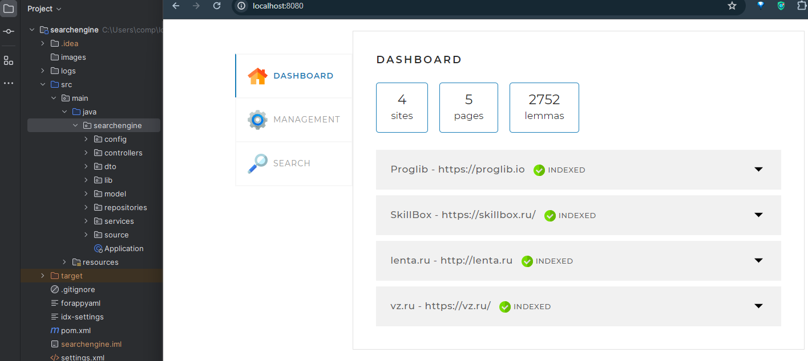
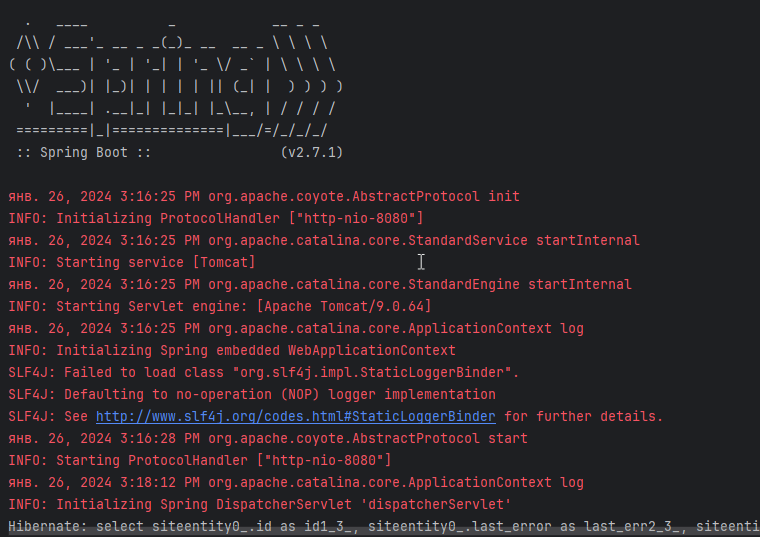
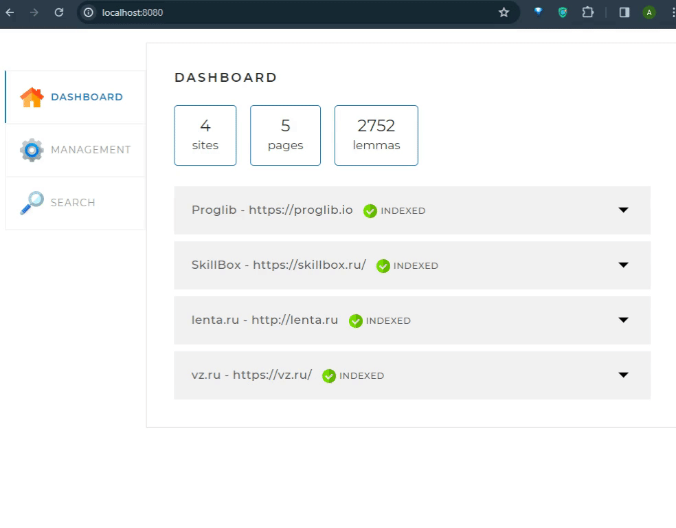
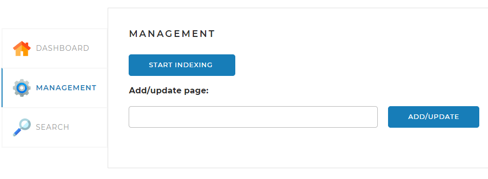
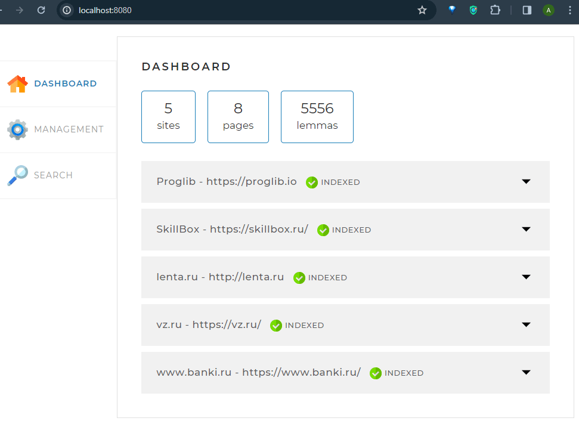

# Поисковый движок

Поисковый движок с индексацией страниц сайта

# Требования:
* Java 8

## Установка
1) Для установки проекта склонируйте репозиторий:
https://github.com/abartenev/searchengine.git

2) Перейдите в каталог проекта
3) Скомпилируйте и запустите проект. В окне терминала должна будет отразиться следующая информация:

## Технологии в проекте
Проект реализован с использованием следующих фреймворков:
* **Spring Boot** - фреймворк для разработки веб-приложений на Java. С помощью него можно развернуть локальный сервер для проверки написанного веб-приложения. 
* **thymeleaf** - фреймворк для генерации HTML кода и шаблонизации, 
с помощью него мы заполняем страницу сайта поисковика результатами из приложения.
* **Lombok** - библиотека, автоматически генерирующая код в создаваемых классах, который обычно приходиться присать вручную. 
Например геттеры и сеттеры, конструкторы либо создавать операторы бизнесового сравнения объекта класса.
* **Log4j2** - это библиотека для логирования в Java. Она позволяет регистрировать сообщения об ошибках, предупреждениях, и других событиях. Данная библиотека позволяет настроить уровень логирования по типам событий.
* **Morphology** - библиотека для морфологического анализа русского языка. Она позволяет разбивать слова на составные части, такие как корни, приставки, и суффиксы. 
**_С помощью данной библиотеки построена основная логика разбора и анализа слов при индексации страниц сайта_**

### Основные разделы сайта представлены на изображении ниже:

На вкладке `MANAGEMENT` можно добавить интересующий сайт и запустить индексирование:

Результаты индексирования представлены на основной странице `DASHBOARD`.

Результаты поиска по интересующей информации выглядят следующим образом:

### Основные моменты, с которыми пришлось столкнуться при реализации проекта:
В процессе разработки были реализованы основные методы взаимодействия `REST` контроллера (_Для взаимодействия страницы с функционалом сервисов и обращения к базе_).

При помощи forkJoinPool были реализованы основные методы параллельного скраппинга страниц сайтов, а также индексация страниц с помощью _лемматизации_ слов.

> [!TIP]
> В процессе разработки и изучении совместного использования различных фреймворков помог анализ готовых проектов, использующих необходимые для разработки технологии. 

